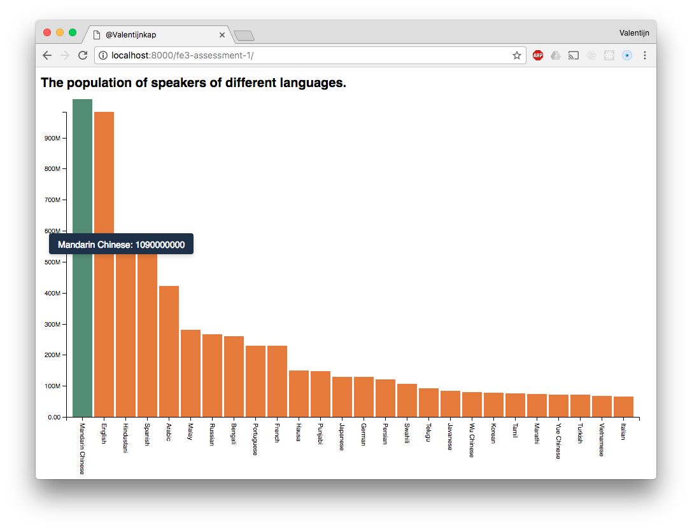

Based on the example from [Mike Bostock](https://bl.ocks.org/mbostock/3885304)

# Population of speakers of different languages



The demo can be found [here](https://valentijnkap.github.io/fe3-assessment-1/).


## Background
For this assessment I had to pick a dataset and visualize it in a basic chart from the [D3 Gallary](https://github.com/d3/d3/wiki/Gallery#basic-charts). The data set I picked showed the population of speakers of different languages. So I decided it could be visualized in a simple barchart and give it some detail along the way.

### The data

```
language	speakers
Mandarin Chinese	1090000000
English	983000000
Hindustani	544000000
Spanish	527000000
Arabic	422000000
Malay	281000000
Russian	267000000
Bengali	261000000
Portuguese	229000000
French	229000000
Hausa	150000000
Punjabi	148000000
Japanese	129000000
German	129000000
Persian	121000000
Swahili	107000000
Telugu	92000000
Javanese	84000000
Wu Chinese	80000000
Korean	77000000
Tamil	75000000
Marathi	74000000
Yue Chinese	72000000
Turkish	71000000
Vietnamese	68000000
Italian	66000000
```

## The proces

### Formating the values on the Y axis
The original data from the example was shown in a percentage. With my data I needed to show numbers in millions so I needed to change the value format. After searching for the solution I stumbeld on issue on github where the exact same situation was solved. so I used the answer from [Micheal Bockstock](https://github.com/d3/d3/issues/2241). To get my values in millions I used the `d3.format()` function and write the following code:

```javascript

var formatSpeakers = d3.format(".3s")

g.append("g")
	.attr("class", "axis axis--y")
	.call(d3.axisLeft(y)
		.tickFormat(function(d) { 
			return formatSpeakers(d)
		})
	)
```

### Rotating the labels on the X axis
The name of the languages where to long so I wanted to rotate the text on the X axis. At first I tried to style it but the the whole X axis was rotated. I just wanted to rotate the text so I found an example from [Micheal Bockstock](https://bl.ocks.org/mbostock/4403522) who used this technique. Then I discoverd that I needed to select the text elements first instead of the whole group. To accomplishing the right rotating I used the `.selectAll("text")` selector and then apply the styles.


### Adding tooltips
To make the chart even more readable I wanted to give the chart some tooltips. I found another chart from [David Andrés](https://bl.ocks.org/ayala-usma/d2f3b89c84e4ed66e22d02affcdcab73) who used tooltips on way that could be easily implemented. At first I started to create the tooltip itself and then activate with a `.on(mousemove)` and `.on(mouseout)` event.

Here's what I did:

```javascript

var tooltip = d3.select("body").append("div").attr("class", "toolTip")

.on("mousemove", function(d){
	d3.select(this).attr("fill", "#588C73")
	tooltip
		.style("left", d3.event.pageX - 50 + "px")// This wil make the mouse as starting point for the tooltip.
		.style("top", d3.event.pageY - 70 + "px")// Same as this.
		.style("display", "inline-block")
		.html((d.language) + ": " + d.speakers)
})
// On the mouse out the bars will return in their original state.
.on("mouseout", function(d){
	d3.select(this).attr("fill", "#E27C29") 
	tooltip.style("display", "none")
})

```


## Features


## To do's
- [ ] Add some css to make it more appealing.
- [ ] Fix the max on the Y axis so the bar won't go of the chart.
- [ ] Add some labels to the axis end.


### LICENSE

[GNU General Public License, version 3.][https://opensource.org/licenses/GPL-3.0]